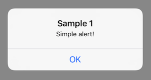
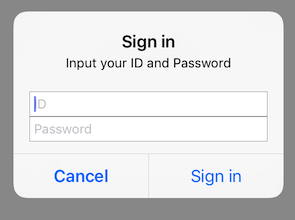
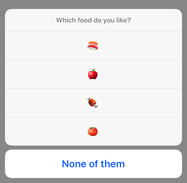
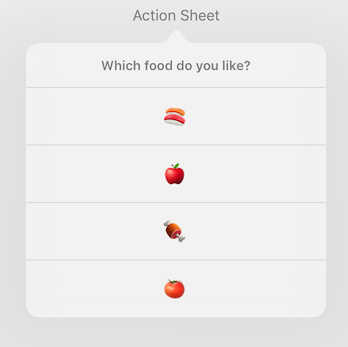
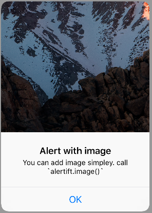
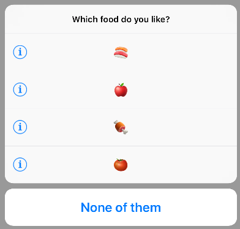
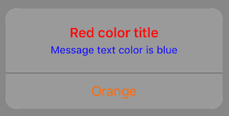

# How to use
## Examples

### Simple Alert

```swift
Alertift.alert(title: "Sample 1", message: "Simple alert!")
    .action(.default("OK"))
    .show(on: self) // show on specified view controller
```




```swift
Alertift.alert(title: "Confirm", message: "Delete this post?")
    .action(.destructive("Delete")) {
        // delete post
    }
    .action(.cancel("Cancel"))
    .show()
    // Default presented view controller is `UIApplication.shared.keyWindow?.rootViewController`
```


### Prompt Alert

```swift
Alertift.alert(title: "Sign in", message: "Input your ID and Password")
    .textField { textField in
        textField.placeholder = "ID"
    }
    .textField { textField in
        textField.placeholder = "Password"
        textField.isSecureTextEntry = true
    }
    .action(.cancel("Cancel"))
    .action(.default("Sign in")) { _, _, textFields in
        let id = textFields?.first?.text ?? ""
        let password = textFields?.last?.text ?? ""
        // sign in
    }
    .show()
```



### Action Sheet

```swift
Alertift.actionSheet(message: "Which food do you like?")
    .actions(["🍣", "🍎", ,"🍖", "🍅"])
    .action(.cancel("None of them"))
    .finally { action, index in
       if action.style == .cancel {
           return
       }
       Alertift.alert(message: "\(index). \(action.title!)")
           .action(.default("OK"))
           .show()
    }
    .show()
```



#### for iPad
Use `popover(anchorView:)` simply.

```swift
Alertift.actionSheet(message: "Which food do you like?")
   .popover(anchorView: button)
   .actions(["🍣", "🍎", ,"🍖", "🍅"])
   .action(.cancel("None of them"))
   .finally { action, index in
      if action.style == .cancel {
          return
      }
      Alertift.alert(message: "\(index). \(action.title!)")
          .action(.default("OK"))
          .show()
   }
   .show()
```

or, use `popover(sourceView:SourceRect)`

```swift
Alertift.actionSheet(message: "Which food do you like?")
   .popover(sourceView: self.view, sourceRect: button.frame)
   .action(.default("🍣"))
   .action(.default("🍎"))
   .action(.default("🍖"))
   .action(.default("🍅"))
   .action(.cancel("None of them"))
   .finally { action, index in
       if action.style == .cancel {
           return
       }
       Alertift.alert(message: "\(index). \(action.title!)")
           .action(.default("OK"))
           .show()
   }
   .show()
```




### Display Image

```swift
let alertImage: UIImage = ...
Alertift.alert(title: "Alert with image", message: "You can add image simpley. call `alertift.image()`")
    .image(alertImage)
    .action(.default("OK"))
    .show()
```



### Add imaget to UIAlertAction

```swift
let infoIconImage: UIImage = ...
Alertift.actionSheet(message: "Which food do you like?", anchorView: anchorView)
    .action(.default("🍣"), image: infoIconImage)
    .action(.default("🍎"), image: infoIconImage)
    .action(.default("🍖"), image: infoIconImage)
    .action(.default("🍅"), image: infoIconImage)
    .action(.cancel("None of them"))
    .finally { action, index in
        if action.style == .cancel {
            return
        }
        Alertift.alert(message: "\(index). \(action.title!)")
            .action(.default("OK"))
            .show()
    }
    .show()
```



### Change colors

```swift
Alertift.alert(title: "Red color title", message: "Message text color is blue")
    .titleTextColor(.red)
    .messageTextColor(.blue)
    .backgroundColor(.lightGray)
    .buttonTextColor(.orange)
    .action(.default("Orange"))
    .show()
```



```swift
public func backgroundColor(_ color: UIColor?) -> Self
public func buttonTextColor(_ color: UIColor?) -> Self
public func titleTextColor(_ color: UIColor?) -> Self
public func messageTextColor(_ color: UIColor?) -> Self
```

#### Always change color

If you want to change Alertift's alert(action sheet) color always,  
set color to `static var`.

```swift
Alertift.Alert.titleTextColor = .red
Alertift.ActionSheet.backgroundColor = .gray
```

```swift
static var backgroundColor: UIColor? { get set }
static var buttonTextColor: UIColor? { get set }
static var titleTextColor: UIColor? { get set }
static var messageTextColor: UIColor? { get set }
```
