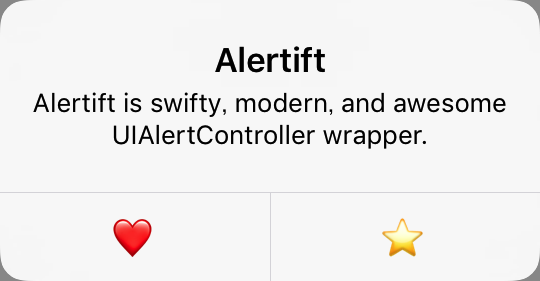

# Alertift



```swift
Alertift.alert(title: "Alertift", message: "Alertift is swifty, modern, and awesome UIAlertController wrapper.")
    .action(.default("❤️"))
    .action(.default("⭐"))
    .show(on: self)
```

[](https://github.com/sgr-ksmt/Alertift/releases)

[](https://github.com/Carthage/Carthage)
[](https://cocoapods.org/pods/Alertift)
[](https://cocoapods.org/pods/Alertift)


## Feature
- Method chain.
- Can add multiple actions at once.
- UITextField support.
- Image support. (above v3.1)
- iPad support(Action Sheet, popover).
- Can change title/message/button text/ background color **without** using private APIs.
- Can change title/message's alignment **without** using private APIs.

## How to use
👉👉👉 **[How to use](Documents/how_to_use.md)**

## Requirements
- iOS 9.0+
- Xcode 10+
- Swift 5.0+

## Installation

### Carthage

- Add the following to your *Cartfile*:

```bash
# Swift5.0
github "sgr-ksmt/Alertift" ~> 4.1

# Swift4.2
github "sgr-ksmt/Alertift" ~> 4.0

# Swift4 or 4.1
github "sgr-ksmt/Alertift" ~> 3.2

# Less than Swift4
github "sgr-ksmt/Alertift" ~> 2.0
```

- Run `carthage update`
- Add the framework as described.
<br> Details: [Carthage Readme](https://github.com/Carthage/Carthage#adding-frameworks-to-an-application)


### CocoaPods

**Alertift** is available through [CocoaPods](http://cocoapods.org). To install
it, simply add the following line to your Podfile:

```ruby
# Swift5.0 or later
pod 'Alertift', '~> 4.1'
# Swift4.2
pod 'Alertift', '4.0'

# Swift4 or 4.1
pod 'Alertift', '~> 3.0'

# Less than Swift4
pod 'Alertift', '~> 2.0'
```

and run `pod install`

### Manually Install
Download all `*.swift` files and put your project.

## Communication
- If you found a bug, open an issue.
- If you have a feature request, open an issue.
- If you want to contribute, submit a pull request.:muscle:

## License

**Alertift** is under MIT license. See the [LICENSE](LICENSE) file for more info.
